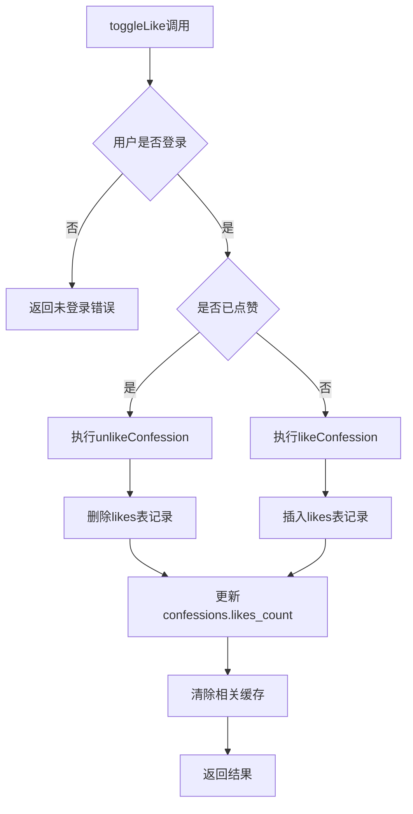

# 点赞功能异常问题分析与解决方案

## 一、问题描述
点赞操作执行后数据自动删除，表现为用户点击点赞按钮后，点赞状态没有持久化，很快恢复为未点赞状态。

## 二、业务逻辑流程分析

### 1. 前端交互
- 用户点击点赞按钮
- 调用 `toggleLike` 函数切换点赞状态

### 2. 后端处理流程


### 3. 核心代码分析
- **toggleLike函数**：src/services/confessionService.ts:642-764
  - 检查用户登录状态
  - 查询当前点赞状态
  - 执行点赞或取消点赞操作
  - 清除相关缓存

- **likeConfession函数**：src/services/confessionService.ts:553-585
  - 插入点赞记录到likes表
  - 清除相关缓存

- **unlikeConfession函数**：src/services/confessionService.ts:588-618
  - 从likes表删除点赞记录
  - 清除相关缓存

## 三、数据库结构与触发器分析

### 1. 数据库表结构
- **likes表**：存储点赞记录，包含confession_id和user_id的唯一约束
- **confessions表**：存储表白内容，包含likes_count字段

### 2. 触发器机制
- **update_likes_count函数**：在likes表插入或删除时更新confessions表的likes_count字段
- **update_likes_count_after_insert触发器**：在likes表插入后执行
- **update_likes_count_after_delete触发器**：在likes表删除后执行

### 3. RLS策略
- likes表启用了RLS
- 插入策略：允许认证用户插入
- 删除策略：允许记录所有者删除
- 读取策略：允许公开读取

## 四、可能的问题原因

### 1. 代码逻辑问题
- **并发问题**：多个请求同时执行toggleLike可能导致数据不一致
- **事务处理**：缺少事务机制确保点赞操作的原子性
- **缓存问题**：缓存清除不彻底导致数据显示异常

### 2. 数据库配置问题
- **RLS策略配置不当**：可能导致插入操作被阻止
- **触发器或其他数据库逻辑**：可能存在其他触发器或函数导致数据删除
- **唯一约束冲突**：虽然代码中处理了唯一约束冲突，但可能存在其他情况

### 3. Supabase MCP架构相关问题
- **资源隔离问题**：多租户环境下可能存在资源隔离问题
- **权限控制问题**：可能存在权限配置不当导致数据删除
- **配置同步问题**：可能存在配置不同步导致的问题

## 五、解决方案建议

### 1. 代码优化
- **添加事务处理**：确保点赞操作的原子性
- **增强日志记录**：在关键操作点添加详细日志，便于调试
- **优化缓存机制**：确保缓存清除彻底，避免数据不一致

### 2. 数据库优化
- **检查并优化RLS策略**：确保点赞操作的RLS策略配置正确
- **检查触发器和其他数据库逻辑**：确保没有其他触发器或函数导致数据删除
- **添加监控机制**：监控likes表的数据变化，便于定位问题

### 3. Supabase MCP架构优化
- **检查资源隔离配置**：确保多租户环境下资源隔离正确
- **检查权限控制配置**：确保权限配置正确，避免误删数据
- **检查配置同步**：确保所有配置同步正确

### 4. 具体修改建议

#### 4.1 增强toggleLike函数的事务处理
```typescript
toggleLike: async (confessionId: string): Promise<{ success: boolean; error?: string }> => {
  try {
    // 检查用户登录状态...
    
    // 使用事务确保操作原子性
    const { data, error } = await supabase.rpc('toggle_like', {
      p_confession_id: confessionId,
      p_user_id: userId
    });
    
    if (error) {
      throw error;
    }
    
    // 清除缓存...
    
    return { success: true };
  } catch (error) {
    // 处理错误...
  }
}
```

#### 4.2 创建PostgreSQL函数处理点赞逻辑
```sql
CREATE OR REPLACE FUNCTION toggle_like(p_confession_id UUID, p_user_id UUID)
RETURNS BOOLEAN AS $$
BEGIN
  -- 检查是否已点赞
  IF EXISTS (SELECT 1 FROM likes WHERE confession_id = p_confession_id AND user_id = p_user_id) THEN
    -- 已点赞，执行取消点赞
    DELETE FROM likes WHERE confession_id = p_confession_id AND user_id = p_user_id;
    RETURN FALSE;
  ELSE
    -- 未点赞，执行点赞
    INSERT INTO likes (confession_id, user_id) VALUES (p_confession_id, p_user_id);
    RETURN TRUE;
  END IF;
END;
$$ LANGUAGE plpgsql;
```

#### 4.3 增强日志记录
```typescript
// 在关键操作点添加详细日志
console.log('[ConfessionService] Before inserting like:', { confessionId, userId });
const { data: insertedLike, error: insertError } = await supabase
  .from('likes')
  .insert(likeData)
  .select();
console.log('[ConfessionService] After inserting like:', { insertedLike, insertError });
```

## 六、测试与验证方案

### 1. 功能测试
- 测试点赞功能是否正常工作
- 测试取消点赞功能是否正常工作
- 测试多次点赞是否会导致数据异常

### 2. 并发测试
- 模拟多个用户同时点赞同一表白
- 测试并发情况下数据是否一致

### 3. 边界情况测试
- 测试未登录用户点赞
- 测试点赞不存在的表白
- 测试重复点赞同一表白

### 4. 性能测试
- 测试点赞功能的响应时间
- 测试高并发情况下的性能表现

## 七、预期效果

通过以上优化和修改，预期可以解决点赞操作执行后数据自动删除的问题，确保点赞功能的正常工作。同时，增强了系统的稳定性和可维护性，便于后续的功能扩展和问题定位。