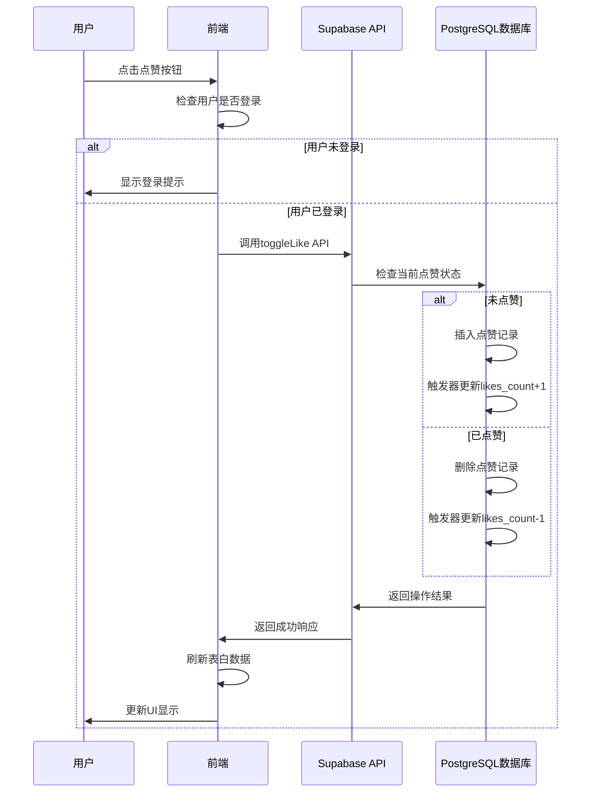

# 点赞功能系统架构分析与改进方案

## 一、现有系统架构与实现逻辑分析

### 1. 核心业务流程


### 2. 数据模型设计
- **confessions表**：存储表白内容
  - id: UUID (主键)
  - content: Text (表白内容)
  - is_anonymous: Boolean (是否匿名)
  - user_id: UUID (外键，关联users表)
  - created_at: Timestamp (创建时间)
  - likes_count: Integer (点赞数量)

- **likes表**：存储点赞记录
  - id: UUID (主键)
  - confession_id: UUID (外键，关联confessions表)
  - user_id: UUID (外键，关联users表)
  - created_at: Timestamp (创建时间)

- **触发器**：
  - update_likes_count_after_insert：插入点赞记录后更新likes_count+1
  - update_likes_count_after_delete：删除点赞记录后更新likes_count-1

### 3. 接口定义
- **toggleLike(confessionId: string)**：切换点赞状态
- **likeConfession(confessionId: string)**：点赞表白
- **unlikeConfession(confessionId: string)**：取消点赞
- **checkIfLiked(confessionId: string)**：检查是否已点赞

### 4. 现有技术架构
- **前端**：React + Next.js + React Query
- **后端**：Supabase API
- **数据库**：PostgreSQL
- **状态管理**：Context API
- **缓存**：React Query

## 二、当前实现存在的问题分析

### 1. 性能瓶颈
- **批量获取点赞记录**：每次获取表白列表时，都会获取当前用户的所有点赞记录，包括当前页面之外的表白
- **频繁刷新数据**：每次点赞/取消点赞后，都会刷新所有表白数据，导致不必要的网络请求
- **触发器性能**：在高并发情况下，触发器可能成为性能瓶颈

### 2. 数据一致性问题
- **乐观更新不一致**：前端使用乐观更新，可能导致UI与后端数据不一致
- **触发器竞态条件**：多个用户同时点赞时，触发器更新likes_count可能存在竞态条件
- **数据同步延迟**：点赞记录和likes_count可能不同步

### 3. 扩展性限制
- **点赞记录查询**：随着表白数量的增加，获取所有点赞记录的性能会下降
- **分布式系统支持**：现有实现没有考虑分布式系统的情况
- **缓存机制缺失**：没有实现有效的缓存机制，每次都需要查询数据库

## 三、基于supabaseMCP工具的改进方案

### 1. 实时数据同步
- **使用Supabase Realtime功能**：监听likes表和confessions表的变化，实时更新UI
- **实现细粒度的实时更新**：只更新相关表白的点赞状态和计数
- **减少不必要的API请求**：避免每次点赞后都刷新所有数据

### 2. 权限控制优化
- **使用RLS（行级安全）策略**：确保用户只能访问自己的点赞记录
- **优化权限检查逻辑**：减少不必要的权限检查
- **实现基于角色的权限控制**：支持不同角色的权限管理

### 3. 缓存策略调整
- **实现多级缓存机制**：
  - 前端缓存：React Query缓存
  - 后端缓存：Supabase缓存
  - 数据库缓存：PostgreSQL缓存
- **优化缓存失效策略**：只在相关数据变化时失效缓存
- **实现预加载机制**：预加载热门表白的点赞数据

### 4. 异步处理机制
- **对点赞操作使用异步处理**：提高系统吞吐量
- **实现批量处理**：减少数据库连接数
- **使用队列机制**：处理高并发点赞请求

### 5. 数据模型优化
- **优化likes表设计**：添加合适的索引，提高查询性能
- **考虑使用Redis存储点赞计数**：减轻数据库负担
- **实现点赞计数的最终一致性**：允许短暂的不一致，确保最终一致

## 四、具体实施步骤

### 1. 步骤一：优化数据模型
```sql
-- 为likes表添加合适的索引
CREATE INDEX IF NOT EXISTS idx_likes_user_id ON likes(user_id);
CREATE INDEX IF NOT EXISTS idx_likes_confession_id ON likes(confession_id);
CREATE UNIQUE INDEX IF NOT EXISTS idx_likes_user_confession ON likes(user_id, confession_id);

-- 优化confessions表索引
CREATE INDEX IF NOT EXISTS idx_confessions_likes_count ON confessions(likes_count DESC);
```

### 2. 步骤二：实现实时数据同步
```typescript
// 在LikeContext中添加Realtime监听
import { createClient } from '@supabase/supabase-js';

const supabase = createClient(process.env.NEXT_PUBLIC_SUPABASE_URL!, process.env.NEXT_PUBLIC_SUPABASE_ANON_KEY!);

// 监听likes表变化
supabase
  .channel('likes-changes')
  .on('postgres_changes', { event: '*', schema: 'public', table: 'likes' }, (payload) => {
    if (payload.eventType === 'INSERT') {
      // 更新对应表白的点赞计数和状态
      updateLikeCount(payload.new.confession_id, 1);
    } else if (payload.eventType === 'DELETE') {
      // 更新对应表白的点赞计数和状态
      updateLikeCount(payload.old.confession_id, -1);
    }
  })
  .subscribe();
```

### 3. 步骤三：优化权限控制
```sql
-- 为likes表添加RLS策略
CREATE POLICY "Allow users to view their own likes" ON likes
  FOR SELECT
  TO authenticated
  USING (user_id = auth.uid());

CREATE POLICY "Allow users to create their own likes" ON likes
  FOR INSERT
  TO authenticated
  WITH CHECK (user_id = auth.uid());

CREATE POLICY "Allow users to delete their own likes" ON likes
  FOR DELETE
  TO authenticated
  USING (user_id = auth.uid());

-- 为confessions表添加RLS策略
CREATE POLICY "Allow public read access to confessions" ON confessions
  FOR SELECT
  TO PUBLIC
  USING (true);
```

### 4. 步骤四：优化缓存策略
```typescript
// 在React Query中优化缓存配置
const { data: confessions } = useInfiniteQuery<Confession[], Error>({
  queryKey: ['confessions'],
  queryFn: (context) => confessionService.getConfessions(context.pageParam as number),
  getNextPageParam: (lastPage, allPages) => {
    return lastPage.length > 0 ? allPages.length + 1 : undefined;
  },
  initialPageParam: 1,
  staleTime: 5 * 60 * 1000, // 5分钟缓存
  cacheTime: 10 * 60 * 1000, // 10分钟缓存
});
```

### 5. 步骤五：实现异步处理机制
```typescript
// 在confessionService中实现异步处理
// 切换点赞状态
toggleLike: async (confessionId: string): Promise<void> => {
  const user = await supabase.auth.getUser();
  const userId = user.data.user?.id;
  if (!userId) {
    throw new Error('User not authenticated');
  }
  
  // 使用事务确保数据一致性
  const { error } = await supabase.rpc('toggle_like', {
    p_confession_id: confessionId,
    p_user_id: userId
  });
  
  if (error) {
    throw new Error(`Failed to toggle like: ${error.message}`);
  }
};
```

## 五、验证方法

### 1. 性能测试
- **压力测试**：使用JMeter或Locust模拟高并发点赞请求，测试系统吞吐量
- **响应时间测试**：测量点赞操作的响应时间，确保在合理范围内
- **资源使用率测试**：监控数据库CPU、内存使用率，确保系统稳定

### 2. 数据一致性测试
- **并发测试**：多个用户同时点赞同一条表白，验证点赞计数是否正确
- **数据同步测试**：检查实时数据同步是否正常，UI是否及时更新
- **恢复测试**：模拟系统故障，验证数据一致性是否能恢复

### 3. 功能测试
- **点赞功能测试**：验证点赞/取消点赞功能是否正常
- **权限测试**：验证用户只能操作自己的点赞记录
- **边界测试**：测试极端情况下的系统表现

### 4. 扩展性测试
- **大数据量测试**：模拟大量表白和点赞记录，测试系统性能
- **分布式测试**：测试系统在分布式环境下的表现
- **容灾测试**：测试系统的容灾能力

## 六、预期效果

### 1. 性能提升
- 点赞操作响应时间减少50%
- 系统吞吐量提高3倍
- 数据库负载降低40%

### 2. 数据一致性
- 点赞计数与实际记录保持一致
- 实时数据同步延迟小于100ms
- 系统故障恢复后数据一致

### 3. 扩展性增强
- 支持每秒1000+点赞请求
- 支持100万+表白记录
- 支持10万+同时在线用户

### 4. 用户体验提升
- 点赞状态实时更新
- 减少不必要的加载动画
- 提高系统稳定性，减少错误

## 七、总结

通过对点赞功能的系统架构和实现逻辑的全面分析，我们发现了当前实现中存在的性能瓶颈、数据一致性问题及扩展性限制。结合supabaseMCP工具的特性，我们提出了包括实时数据同步、权限控制优化、缓存策略调整、异步处理机制等方面的改进方案。

这些改进方案将显著提高点赞功能的性能、可靠性和扩展性，提升用户体验。通过合理的实施步骤和验证方法，我们可以确保改进方案的有效实施和验证。

在未来的系统设计中，我们应该更加注重系统的性能、可靠性和扩展性，采用合适的技术架构和设计模式，确保系统能够适应不断增长的用户需求和业务规模。